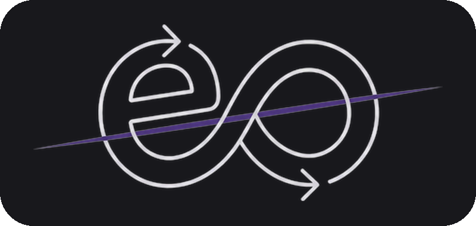

<p align="center">
  
</p>

<p align="center">
  
  
  
  
  
  
</p>

<h1 align="center">engception</h1>

<p align="center">
  <strong>번역하지 말고, 말할 수 있게 바꾸자</strong><br/>
  한국어로 떠오른 복잡한 생각을 영어로 <strong>실제 말할 수 있는 구조</strong>로 바꿔주는 훈련 앱
</p>

---

## What is engception?

영어를 못해서 말을 못하는 게 아니다. **머릿속에 떠오른 한국어가 너무 정교해서**, 영어로 바로 옮기려다 말문이 막히는 거다.

기존 영어 앱들은 "문장 외워라", "많이 말해라"에 집중한다. 하지만 진짜 병목은 그 이전 단계 — **사고를 영어 친화적으로 재구성하는 능력** — 이다. engception은 이 문제를 정면으로 다룬다.

```
"네가 틀렸다고 말하려는 건 아닌데, 그 말은 좀 서운했어."

→ 의미 분해: 1) 네가 틀렸다는 게 아니다
             2) 그 말이 나를 서운하게 했다

→ 3단계 영어: Safe    — I'm not saying you're wrong. But that hurt a little.
              Natural — I'm not trying to say you're wrong — I just felt a bit hurt by what you said.
              Refined — I don't mean to say you're wrong. It's just that what you said stung a little.

→ 추출 패턴: I'm not saying A. I just felt B.
```

### Why engception?

| 기존 영어 앱 | engception |
|:-----------:|:-----------:|
| 정답 문장 제공 | 사고 재구성 훈련 |
| 단어/표현 암기 | 발화 구조 패턴 축적 |
| 번역 결과 제시 | 왜 어렵고 어떻게 쪼개는지 설명 |
| AI가 다 해줌 | 내가 먼저 시도, AI가 피드백 |

---

## Architecture

```
  한국어 원문          의미 분해          쉬운 한국어         짧은 영어          자연스러운 영어
 ┌──────────┐    ┌──────────┐    ┌──────────┐    ┌──────────┐    ┌──────────┐
 │ 복잡하고   │ ─→ │ 핵심 의미  │ ─→ │ 영어로    │ ─→ │ 일단     │ ─→ │ 뉘앙스    │
 │ 긴 한국어  │    │ 2~3개로   │    │ 옮기기    │    │ 말할 수   │    │ 까지      │
 │ 사고      │    │ 쪼개기    │    │ 쉬운 형태  │    │ 있는 영어  │    │ 살린 영어  │
 └──────────┘    └──────────┘    └──────────┘    └──────────┘    └──────────┘
                     ▲                ▲                ▲
                  내가 시도          내가 시도          내가 시도
                  AI가 비교          AI가 비교          AI가 비교
```

핵심은 **내가 먼저 시도하고, AI가 비교 피드백을 주는 것**. 보기만 하면 학습이 아니다.

### Learning Flow

| # | 누가 | 뭘 하는가 |
|:-:|:----:|-----------|
| 01 | 앱 | 시나리오 제시 또는 직접 입력 |
| 02 | 나 | 문장을 2~3개 뜻 단위로 쪼개본다 |
| 03 | AI | 의미 분해 제안 + 내 시도와 비교 피드백 + 왜 이 문장이 영어로 어려운지 설명 |
| 04 | 나 | 쉬운 한국어로 바꿔본다 |
| 05 | AI | 쉬운 한국어 제안 + 비교 피드백 |
| 06 | 나 | 영어로 말해본다 |
| 07 | AI | 3단계 영어 제시 — `Safe → Natural → Refined` + 피드백 |
| 08 | AI | 재사용 가능한 말하기 패턴 추출 |

---

## Key Features

### 오늘의 시나리오

매일 현실적인 상황 기반 문장 제공. "연인과 다툰 뒤", "회의에서 반대 의견" 같은 실제로 말문이 막히는 맥락에서 출발한다.

### 내 문장 입력

실제 하고 싶었던 말을 직접 훈련할 수 있다. 미리 준비된 시나리오에 국한되지 않는다.

### 의미 분해

긴 문장을 말하기 쉬운 단위로 쪼갠다. 사용자가 먼저 시도하고, AI가 쪼개는 방식을 비교해서 보여준다.

### 쉬운 한국어

영어로 옮기기 쉬운 **중간 단계** 를 거친다. 한국어 → 쉬운 한국어 → 영어의 3-hop 구조로, 직접 번역의 인지 부하를 낮춘다.

### 단계별 영어

`Safe → Natural → Refined` 세 단계로 영어를 제시한다. 상황과 실력에 맞게 고를 수 있다.

### 패턴 추출

`I'm not saying A. I just felt B.` 같은 재사용 가능한 발화 구조를 추출해서 저장한다.

### 패턴 라이브러리

저장된 패턴은 카테고리별로 모아 검색, 관리할 수 있다.

### 복습

저장한 문장과 패턴을 다시 풀면서 체화한다.

---

## Quick Start

### Prerequisites

- [Node.js 20+](https://nodejs.org/)
- (선택) [Anthropic API Key](https://console.anthropic.com/) — 실제 AI 응답 사용 시

### 1. Clone & Install

```bash
git clone https://github.com/LivingLikeKrillin/eng-ception.git
cd eng-ception
npm install
```

### 2. Configure

```bash
cp .env.local.example .env.local
# .env.local에 Anthropic API 키 입력
```

### 3. Run

```bash
npm run dev          # 프론트엔드  → http://localhost:5173
npm run dev:api      # API 프록시  → http://localhost:3001
```

---

## Project Structure

```
eng-ception/
├── api/                    # Vercel Edge Functions
│   └── chat.ts             # Claude API 프록시
├── src/
│   ├── components/
│   │   ├── common/         # Navigation, StepIndicator, FeedbackCard
│   │   ├── home/           # ScenarioCard, RecentLearning
│   │   └── learning/       # 학습 플로우 컴포넌트
│   ├── data/               # 시드 시나리오 데이터
│   ├── pages/              # Home, Learn, Patterns, Review
│   ├── services/           # Claude API 호출, 프롬프트 템플릿
│   ├── store/              # Zustand 스토어, DataStore 추상화
│   └── types/              # TypeScript 타입 정의
├── dev-server.js           # 로컬 개발용 API 프록시
└── vite.config.ts
```

---

## Roadmap

```
Phase 1 — MVP
  ├ 인터랙티브 학습 플로우
  ├ 시나리오 카드 시스템 (10개 시드)
  ├ 패턴 추출 및 라이브러리
  └ PWA 지원

Phase 2 — 데이터 / 콘텐츠
  ├ 데이터 레이어 마이그레이션
  ├ 시나리오 배치 자동 생성 (50~100개)
  └ Spaced Repetition 복습 알고리즘

Phase 3 — 인식 / 분석
  ├ TTS + 음성 녹음 + 발화 비교
  ├ 사고 패턴 분석 (개인화 인사이트)
  └ OPIc 트랙
```

---

## Tech Stack

| Layer | Technology | Why |
|-------|-----------|-----|
| Language | TypeScript 5.7 | 타입 안전성 + 순수 TS 코어 |
| UI | React 19 | 동시성 + Suspense |
| Build | Vite 6 | HMR + PWA 플러그인 |
| Styling | Tailwind CSS 4 | `@theme` 디자인 토큰 |
| State | Zustand 5 | 가벼운 전역 상태 관리 |
| Routing | React Router 7 | SPA 라우팅 |
| AI | Claude API (Anthropic) | 학습 피드백 생성 |
| API Proxy | Vercel Edge Functions + Express 5 | API 키 서버 사이드 격리 |
| Storage | LocalStorage | Data Layer 추상화 |
| PWA | vite-plugin-pwa + Workbox | 오프라인 캐시, 홈 설치 |

---

## License

Private — all rights reserved.

---

<p align="center">
  <sub>정답을 주는 앱이 아니라, 말문을 여는 앱 · Built with Claude Code</sub>
</p>
